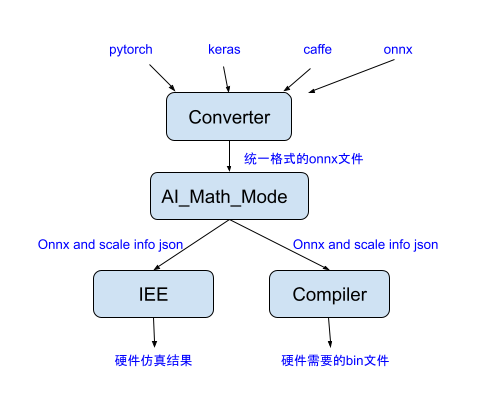
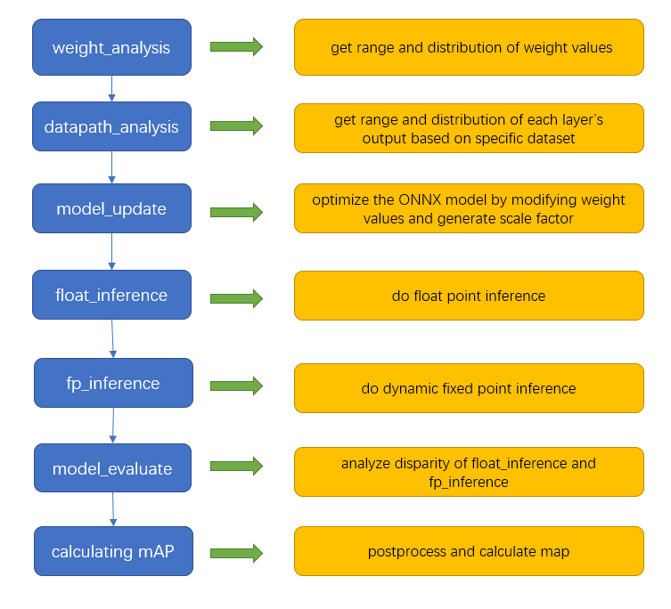

# Tutorial of Toolchain
# Table of Contents
[0. Overview](#0-overview)  
[1. Installation](#1-installation)  
&nbsp;&nbsp;&nbsp;&nbsp;&nbsp;&nbsp;[1.1 system requirements](#11-system-requirements)  
&nbsp;&nbsp;&nbsp;&nbsp;&nbsp;&nbsp;[1.2 docker installation](#12-docker-installation)  
&nbsp;&nbsp;&nbsp;&nbsp;&nbsp;&nbsp;[1.3 pull toolchain image](#13-pull-toolchain-image)  
&nbsp;&nbsp;&nbsp;&nbsp;&nbsp;&nbsp;[1.4 start toolchain image](#14-start-toolchain-image)  
[2. Docker file](#2-docker-file)  
&nbsp;&nbsp;&nbsp;&nbsp;&nbsp;&nbsp;[2.1 folder structure](#21-folder-structure)  
[3. Scripts usage](#3-Scripts-usage)  
&nbsp;&nbsp;&nbsp;&nbsp;&nbsp;&nbsp;[3.1 Converter](#31-converter)   
&nbsp;&nbsp;&nbsp;&nbsp;&nbsp;&nbsp;[3.2 AI_Math_Mod](#32-AI_Math_Mod)   
&nbsp;&nbsp;&nbsp;&nbsp;&nbsp;&nbsp;[3.3 Compiler](#33-Compiler)   
&nbsp;&nbsp;&nbsp;&nbsp;&nbsp;&nbsp;[3.4 workflow script](#34-workflow-script)     
[4. FAQ](#4-FAQ)  
[5. Appendix](#5-Appendix)  
&nbsp;&nbsp;&nbsp;&nbsp;&nbsp;&nbsp;[5.1 Reconfigurable parameters](#51-Reconfigurable-parameters)  
## 0. Overview
Our toolchain currently consists of three parts: Converter, AI_Math_Mod and Compiler.  
**Converter** transforms and optimizes the model files generated from the popular deep learning frameworks (currently we support Keras, Caffe, Pytorch) into the optimized onnx model.  
**AI_Math_Mod** takes optimized onnx and dataset as inputs to analyze the effectiveness of the dynamic fixed point method, and then generates the optimized onnx model and json file for Compiler.  
**Compiler** generates binary files for hardware simulator.   
The toolchain released by docker, which allows users to run on different platforms.

<p align="center"></p>  
<p align="center">Fig.1 workflow of toolchain</p>  


In this document, you'll learn:  
a.How to install and use the toolchain docker(see section 1.Installation).  
b.What tools are in the toolchain(see section 2.Docker file).  
c.How to use scripts to utilize the tools(see section 3.Scripts usage).

## 1. Installation
### 1.1 system requirements
Ubuntu 16+ / Windows 10 professional
### 1.2 docker installation
(1) Windows
https://docs.docker.com/docker-for-windows/install/  
(2) Ubuntu
https://docs.docker.com/engine/install/ubuntu/
### 1.3 pull toolchain image
(1) Log in to your dockerhub account locally:  
``````
sudo docker login -u username
``````  
Please register on dockerhub.com to achieve your username     
(2) Pull the image:  
``````
sudo docker pull wangl98/toolchain:v0.4.1
``````
(3) Check whether the image is pulled successfully:  
``````
sudo docker image ls
``````
### 1.4 start toolchain image  
(1) Start the image:  
``````
sudo docker run -it --rm -v absolute_path_of_your_folder:/data1 wangl98/toolchain:v0.4.1
`````` 
`absolute_path_of_your_folder` is the path of the folder mounted into the docker container. Thus, we can visit the desired files from the host and save the result from the container. For example:  
``````
sudo docker run -it --rm -v /home/nju/Downloads/docker_mount:/data1 wangl98/toolchain:v0.4.1
``````
(2) Copy files under `/workspace/example/` to the mounted folder:  
``````
cp -r /workspace/example/script/ /data1/ && cp -r /workspace/example/config/ /data1/ && cp -r /workspace/example/model/ /data1/ && cp -r /workspace/example/dataset/* /data1/ && cp -r /workspace/example/example/* /data1/
``````  

## 2. Docker file
### 2.1 folder structure   
After logging into the container, you are under `/workspace`, where all the tools are. Here is the folder structure and their usage:  
``````
/workspace
|--Converter: convert the origin model to the optimized onnx model
|--AI_Math_Mod: analyze the onnx model and provide dynamic fixed point inference information
|--Compiler: generate the binary files required by the hardware
|--example: the example files
    |--example: complete example files(contain model, config and script) for yolov3_tiny to run full process
    |--script: shell script examples for various models to run full processes, including Converter, AI_Math_Mod and Compiler
    |--config: config examples for various models
    |--model: various models 
    |--dataset: dataset files
``````

## 3. Scripts usage  
### 3.1 Converter
The general process for model conversion is as following:  
(1)Convert the model from other platforms to onnx using the specific converters. See section 3.1.1 - 3.1.5.  
(2)Optimize the onnx for Kneron toolchain using `onnx2onnx.py`. If the model is from Pytorch, you can skip this step because `pytorch2onnx.py` includes most of the optimizations in `onnx2onnx.py`. See section 3.1.6.  
(3)Check the model and do further customization using editor.py (optional). See section 3.1.7

There are model examples in `/data1/model/` for try. 
#### 3.1.1 keras to onnx
For Keras, our converter support models from `Keras 2.2.4`. Note that `tf.keras` and `Keras 2.3` is not supported. You may need to export the model as tflite model and see section 3.1.5 for TF Lite model conversion.

The related conversion command is:
```
cd /workspace/Converter && python3 keras-onnx/generate_onnx.py -o path_of_output_onnx_file path_of_input_keras_file -O 3
```
example command:
``````
cd /workspace/Converter && python3 keras-onnx/generate_onnx.py -o /data1/model/yolov3_416.h5.onnx /data1/model/yolov3_416.h5 -O 3
``````
other options:
`-O [level]`: Enable optimizations at a specific level. `-O 1` includes eliminating dropout layers. `-O 2` includes fusing paddings into the next layers and replacing some average pooling layers with global average poolibng. `-O 3` includes fusing batch normalization into convolution layers. All the optimization with greater number also includes the optimizations in the lower levels, for example, `-O 3` also includes all the optimizations in `-O 2` and `-O 1`.
#### 3.1.2 caffe to onnx
For caffe, we only support model which can be loaded by Intel Caffe 1.0. Here is the related command:
``````
cd /workspace/Converter && python3 caffe-onnx/generate_onnx.py -o path_of_output_onnx_file -n path_of_input_prototxt_file -w path_of_input_caffemodel_file
``````
example command:
```
cd /workspace/Converter && python3 caffe-onnx/generate_onnx.py -o /data1/model/ssd.caffemodel.onnx -n /data1/model/deploy.prototxt -w /data1/model/ssd.caffemodel
```
#### 3.1.3 pytorch to onnx
The `pytorch2onnx.py` script not only takes `pth` file as the input. It also takes Pytorch exported `onnx` as the input. In fact, we recommend using the Pytorch exported `onnx` file instead of the `pth` file, since the Pytorch do not has a very good model save and load API. You can check TIPS below on how to export models to onnx.
We currently only support models exported by Pytorch version >=1.0.0, <1.6.0, no matter it is a `pth` file or an `onnx` file exported by `torch.onnx`.  
(1) Tips  
You can use torch.onnx to export your model into onnx format. Here is the Pytorch 1.3.0 version document for onnx.torch. An example code for exporting the model is:
``````
import torch.onnx
dummy_input = torch.randn(1, 3, 224, 224)
torch.onnx.export(model, dummy_input, 'output.onnx', keep_initializers_as_inputs=True, opset_version=9)
``````
In the example, `(1, 3, 224, 224)` are batch size, input channel, input height and input width. `model` is the model object you want to export. `output.onnx` is the output file. For Pytorch version before 1.3.0, `keep_initializers_as_inputs=True` is not needed. Otherwise, it is required.  
(2) Run pytorch2onnx with pth file
Here is the related command:
``````
cd /workspace/Converter && python3 optimizer_scripts/pytorch2onnx.py path_of_input_path_file path_of_output_onnx_file --input-size input_shape_of_input_pytorch_model 
``````
example command:
```
cd /workspace/Converter && python3 optimizer_scripts/pytorch2onnx.py /data1/model/resnet50.pth /data1/model/resnet50.pth.onnx --input-size 3 224 224
```
(3) Run pytorch2onnx with onnx file to optimize onnx file
Here is the related command:
``````
cd /workspace/Converter && python3 optimizer_scripts/pytorch2onnx.py path_of_input_onnx_file path_of_output_onnx_file
``````
#### 3.1.4 tensorflow to onnx
Tensorflow to onnx script only support Tensorflow 1.x and the operator support is very limited. If it cannot work on your model, please try to export the model as tflite and convert it using section 3.1.5.
Here is the related command:
``````
cd /workspace/Converter && python3 optimizer_scripts/tensorflow2onnx.py path_of_input_tensorflow_file path_of_output_onnx_file
``````
#### 3.1.5 tf lite to onnx
Here is the related command:
``````
cd /workspace/Converter && python3 tflite-onnx/onnx_tflite/tflite2onnx.py -tflite path_of_input_tflite_file -save_path path_of_output_onnx_file -release_mode True
``````
#### 3.1.6 onnx to onnx  
After converting models from other frameworks to onnx format which are not mentioned above, or you download the onnx models directly from an online source, you need to run the following command to optimize the model. Here is the related command: 
``````
cd /workspace/Converter && python3 optimizer_scripts/onnx2onnx.py path_of_input_onnx_file -o path_of_output_onnx_file
``````  
#### 3.1.7 model editor  
Our project NPU supports most of the compute extensive OPs, such as Conv, BatchNormalization, Fully Connect/GEMM, in order to speed up the model inference run time. On the other hand, there are some OPs that Our project NPU cannot support well, such as Softmax or Sigmod. However, these OPs usually are not compute extensive and they are better to execute in CPU. Therefore, we provides a model editor which is `editor.py` to help user modify the model so that Our project NPU can run the model more efficiently.  
  
(1)Feature 

The script called editor.py is under the folder `/workspace/Converter/optimizer_scripts`. It is a simple ONNX editor which achieves the following functions:  
a.Add nop BN or Conv nodes.  
b.Delete specific nodes or inputs.  
c.Cut the graph from certain node (Delete all the nodes following the node).
d.Reshape inputs and outputs.  
e.Rename the output.   
f.Rename the input. AI_Math_Mod only support the case that input name of the model includes string 'input'. Use --rename-input, the origin input name 'xxx' will be 'xxx_input'.    
g.Rename the inputs of BatchNormalization layer. AI_Math_Mod only support the case that constant inputs(scale,B,mean,var) name of BN node include string 'gamma','beta', 'mean', or 'var'. Use --rename-bn, the origin constant inputs(scale,B,mean,var) name 'xxx' will be 'xxx_gamma','xxx_beta','xxx_mean',or 'xxx_var'.    
h.Add name for all the nodes. If all nodes of the model don't have name, use --add-all-node-name, the name of node will ba same as the output name of the node.
  
(2)Usage  

``````
usage: editor.py [-h] [-c CUT_NODE [CUT_NODE ...]]
                 [--cut-type CUT_TYPE [CUT_TYPE ...]]
                 [-d DELETE_NODE [DELETE_NODE ...]]
                 [--delete-input DELETE_INPUT [DELETE_INPUT ...]]
                 [-i INPUT_CHANGE [INPUT_CHANGE ...]]
                 [-o OUTPUT_CHANGE [OUTPUT_CHANGE ...]]
                 [--add-conv ADD_CONV [ADD_CONV ...]]
                 [--add-bn ADD_BN [ADD_BN ...]]
                 [--rename-output RENAME_OUTPUT [RENAME_OUTPUT ...]]
                 [--rename-input RENAME_INPUT [RENAME_INPUT ...]]
                 [--add-all-node-name ADD_ALL_NODE_NAME [ADD_ALL_NODE_NAME ...]]
                 [--rename-bn RENAME_BN [RENAME_BN ...]]
                 in_file out_file

Edit an ONNX model. The processing sequense is 'delete nodes/values' -> 'add nodes' -> 'change shapes'. Cutting cannot be done with other operations
together

positional arguments:
  in_file               input ONNX FILE
  out_file              ouput ONNX FILE

optional arguments:
  -h, --help            show this help message and exit
  -c CUT_NODE [CUT_NODE ...], --cut CUT_NODE [CUT_NODE ...]
                        remove nodes from the given nodes(inclusive)
  --cut-type CUT_TYPE [CUT_TYPE ...]
                        remove nodes by type from the given nodes(inclusive)
  -d DELETE_NODE [DELETE_NODE ...], --delete DELETE_NODE [DELETE_NODE ...]
                        delete nodes by names and only those nodes
  --delete-input DELETE_INPUT [DELETE_INPUT ...]
                        delete inputs by names
  -i INPUT_CHANGE [INPUT_CHANGE ...], --input INPUT_CHANGE [INPUT_CHANGE ...]
                        change input shape (e.g. -i 'input_0 1 3 224 224')
  -o OUTPUT_CHANGE [OUTPUT_CHANGE ...], --output OUTPUT_CHANGE [OUTPUT_CHANGE ...]
                        change output shape (e.g. -o 'input_0 1 3 224 224')
  --add-conv ADD_CONV [ADD_CONV ...]
                        add nop conv using specific input
  --add-bn ADD_BN [ADD_BN ...]
                        add nop bn using specific input  
  --rename-output RENAME_OUTPUT [RENAME_OUTPUT ...]
                        rename the specific output (e.g. --rename-output old_name new_name)
  --rename-input RENAME_INPUT [RENAME_INPUT ...]
                        rename the input of the model
  --add-all-node-name ADD_ALL_NODE_NAME [ADD_ALL_NODE_NAME ...]
                        add name for all the nodes
  --rename-bn RENAME_BN [RENAME_BN ...]
                        rename the inputs of BatchNormalization layer
``````  
#### 3.1.8 converter workflow example  
There are various model examples in `/data1/model/` for try.
(1) yolov3_416.h5  
```
cd /workspace/Converter && python3 keras-onnx/generate_onnx.py -o /data1/model/yolov3_416.onnx /data1/model/yolov3_416.h5 -O 3  
```  
```  
cd /workspace/Converter && python3 optimizer_scripts/onnx2onnx.py /data1/model/yolov3_416.onnx -o /data1/model/yolov3_416_optimized.onnx  
```  
(2) yolov3_tiny_416.h5  
```
cd /workspace/Converter && python3 keras-onnx/generate_onnx.py -o /data1/model/yolov3_tiny_416.onnx /data1/model/yolov3_tiny_416.h5 -O 3
```
```
cd /workspace/Converter && python3 optimizer_scripts/onnx2onnx.py /data1/model/yolov3_tiny_416.onnx -o /data1/model/yolov3_tiny_416_optimized.onnx
```
(3) mobilenet_v2.h5  
```
cd /workspace/Converter && python3 keras-onnx/generate_onnx.py -o /data1/model/mobilenet.onnx /data1/model/mobilenet_v2.h5 -O 3  
```  
```  
cd /workspace/Converter && python3 optimizer_scripts/onnx2onnx.py /data1/model/mobilenet.onnx -o /data1/model/mobilenet_optimized.onnx  
```  
```  
cd /workspace/Converter && python3 optimizer_scripts/editor.py /data1/model/mobilenet_optimized.onnx  /data1/model/mobilenet_edited.onnx --cut-type GlobalAveragePool --rename-output "out_relu_o0" "output"  
```  
(4) vgg16.h5  
```
cd /workspace/Converter && python3 keras-onnx/generate_onnx.py -o /data1/model/vgg16.onnx /data1/model/vgg16.h5 -O 3  
```  
```  
cd /workspace/Converter && python3 optimizer_scripts/onnx2onnx.py /data1/model/vgg16.onnx -o /data1/model/vgg16_optimized.onnx  
```  
```  
cd /workspace/Converter && python3 optimizer_scripts/editor.py /data1/model/vgg16_optimized.onnx /data1/model/vgg16_edited.onnx --cut-type Flatten --rename-output "block5_pool_o0" "output"  
```

(5)ssd.caffemodel 
```  
cd /workspace/Converter && python3 caffe-onnx/generate_onnx.py -o /data1/model/ssd_caffe.onnx -n /data1/model/deploy.prototxt -w /data1/model/ssd.caffemodel  
```  
```
cd /workspace/Converter && python3 onnx2onnx2.py /data1/model/ssd_caffe.onnx -o /data1/model/ssd_caffe_optimized.onnx -t Concat Reshape Identity Transpose Flatten Dropout Mystery Constant Squeeze Unsqueeze Softmax
```
(6)resnet34.pth  
```  
cd /workspace/Converter && python3 optimizer_scripts/pytorch2onnx.py /data1/model/resnet34.pth /data1/model/resnet34.onnx --input-size 3 224 224  
```  
```  
cd /workspace/Converter && python3 optimizer_scripts/editor.py /data1/model/resnet34.onnx /data1/model/resnet34_edited.onnx --add-all-node-name --rename-input --rename-bn --cut-type GlobalAveragePool Unsqueeze --rename-output "340" "output"  
``` 
(7)resnet50.pth 
```
cd /workspace/Converter && python3 optimizer_scripts/pytorch2onnx.py /data1/model/resnet50.pth /data1/model/resnet50.onnx --input-size 3 224 224  
```
```  
cd /workspace/Converter && python3 optimizer_scripts/editor.py /data1/model/resnet50.onnx /data1/model/resnet50_edited.onnx --add-all-node-name --rename-input --rename-bn --cut-type GlobalAveragePool Unsqueeze --rename-output "492" "output"  
```  
### 3.2 AI_Math_Mod  
#### 3.2.1 Workflow and output file 
(1) workflow 
<p align="center"></p>
<p align="center">Fig.2 steps of AI_Math_Mod</p>  

(2) output file  
``````  
├── input_case_folder
│   ├── weight_analysis_output:  the output results of weight_analysis
│   ├── datapath_analysis_output:  the output results of datapath_analysis
│   ├── img_npy:  the output numpy files of image preprocess.
│   ├── model_update_output:  the output results of model_update
│   ├── float_inference_output:  the output results of float_inference
│   ├── fp_inference_output:  the output results of fp_inference
│   ├── evaluator_output: the output results of model_evaluate
│   ├── float_detection_output: the output results of float_detection
│   ├── fp_detection_output: the output results of fp_detection
│   ├── mAP_result: float_mAP and fp_mAP
│   └── log: log file
``````  
#### 3.2.2 Operation steps  
For the convenience of users, AI_Math_Mod will be integrated with `run_workflow.sh`. You need to complete the following steps to run a complete analysis flow.  
(1)setting under `/data1/input_params.json`, see section 3.2.3(1)  
(2)setting under `/data1/hardware.json`, see section 3.2.3(2)  
(3)run command:  
``````
cd /workspace/AI_Math_Mod && ./run_workflow.sh
``````  
#### 3.2.3 Parameter configuration
(1)input_params.json  
Here is an example:
``````
{
    "input_case_folder": "/data1/testcases",
    "input_onnx_file": "/data1/yolov3_tiny_416_optimized.onnx",
    "input_img_folder": "/data1/voc_3imgs/",
    "hardware_config_file": "/data1/hardware.json",
    "img_preprocess_method": "yolo_keras",
    "output_per_layer": false,
    "log_level": "warning",
    "whether_run_mAP": true,
    "mAP_model_type": "tiny_yolo_v3",
    "whether_run_float": true,
    "analysis_mode": "per_layer",
    "whether_run_update": true,
    "concat_input_change": true,   
    "whether_limit_shift":true,
    "shift_upper_limit":35,
    "shift_lower_limit":-4,
    "img_target_size": [416, 416],
    "keep_aspect_ratio": true,
    "channel_num": "RGB",
    "list_of_customized_name": ["identity", "inputmeannormalization", "inputchannelswap"],
    "whether_run_iee":false
}
``````
Meaning of parameters is shown in section 5.1.1.  
(2)hardware.json    
Here is an example:  
``````
{
    "conv_bitwidth": {
        "kernel": 10,
        "bias": 16
    },
    "bn_bitwidth": 8,
    "working_bitwidth": 32,
    "datapath_bitwidth": 16,
    "leaky_relu_alpha": 16,
    "average_pool_radix": 16,
    "example_customized_config_conv2d_1":{
        "kernel": 10,
        "bias": 16
    }
}  
`````` 
Meaning of parameters is shown in section 5.1.2.
### 3.3 Compiler
Compiler take `scale factor` and `optimized onnx` generated by AI_Math_Mod as input, generate binary files for hardware simulator. You can run the compiler tool by the command below:  
```
python3 Compiler.py -o onnx_file_path -hw hw_config_file_path -s scale_file_path -m memory_file_path -r result_path -l log_level  
``` 
``` 
optional arguments:  
        '-o', '--onnx_file_path', help="path of input onnx model file, to compiler into the binary files", default="",  
        '-hw', '--hw_config_file_path', help="path of hardware config file, which saves the hardware bitwidth info", default="",  
        '-s', '--scale_file_path', help="path of scaling_factor file, which saves the scaling factor info of the model", default="",  
        '-m', '--memory_file_path', help="path of memory config, which saves the hardware memory config", default="",  
        '-r', '--result_path', help="path of result file, which will save the outputs of the compiler", default="",  
        '-l', '--log_level', help="log_level, options: info, warning, error, critical", default="CRITICAL", 
````   
for example:  
```
python3 Compiler.py -o /data1/testcases/model_update_output/update.onnx -hw config/hardware.json -s /data1/testcases/model_update_output/update.json -m config/memory.json -r /data1/compiler_yolov3_tiny/ -l DEBUG
```
### 3.4 workflow script
Here is an example script `/data1/run.sh` for yolov3_tiny to run all the process(including Converter, AI_Math_Mod and Compiler):  
```
cd /data1 && bash run.sh
```
In this example script, parameters are set by `/data1/input_params.json`, inference dataset `voc_3imgs` has three images from `voc_imgs`, so mAP is only 1.2%, time used is about 400 seconds(CPU on our server: 2 chip, 18 cores per chip, Intel(R) Xeon(R) Gold 6240 CPU @ 2.60GHz). If you want to do inference with dataset `voc_imgs`, please change corresponding parameter, time used is about 2 hours.  
Here are more example scripts `/data1/script/run_*.sh` for various models to run all the process. Parameters of `/data1/script/run_*.sh` are set by `/data1/config/input_params_*.json`.

## 4. FAQ  

## 5. Appendix  
### 5.1 Reconfigurable parameters  
### 5.1.1 input_params.json  
1)input_case_folder:   
The path of the folder saving all the output info of AI_Math_Mode. The folder will be cleaned each time, thus it is recommended to use a new folder each time you want to start a new testcase.  
2)input_onnx_file:   
path of the input onnx file for analysis.  
3)input_img_folder:  
path of the input dataset for analysis.  
4)hardware_config_file:  
path of the configuration file for hardware.  
5)img_preprocess_method:  
Options: yolo_keras / ssd_keras / vgg_keras / mobilenet_keras  
method of img preprocess.  
6)output_per_layer:  
Option: True/False  
Whether output results of each layer when inferencing the model. If True, the output of modelEvaluator will contains SNR/PSNR of each layer, and the part of object detection and mAP evaluation will not work; otherwise, the output of modelEvaluator will only contains SNR/PSNR of the last layer.  
7)log_level:  
Option: debug/info/critical  
8)whether_run_mAP:  
Option: True/False  
If True, the part of object detection and mAP calculation will work; otherwise, won't work.  
9)mAP_model_type:  
Option: yolo_v3/tiny_yolo_v3  
This option will configure the anchor.txt and classes.txt during the part of object detection. Currently, it only support the standard yolo_v3 and tiny_yolo_v3  
10)whether_run_float:  
Option: true/false  
If false, the step of weigth_analysis, datapath_analysis, model_update and float_inference will be ignored to accelerate the whole process; otherwise, all the steps will be run.  
Note: if set this option to be false, remember to store the result of weigth_analysis, datapath_analysis, model_update and float_inference in test case folder before running the script run_workflow.sh, because though these steps are ignored, the results of them will be utilized when calculating mAP and SNR.  
11)analysis_mode:  
Option:per layer/per channel weight
If per layer, weight_analysis will calculate range and distribution of weight values in each layer of the model.  
If per channel weight, weight_analysis will calculate range and distribution of weight values in each channel of the model.
12)whether_run_update:  
Option:true/false  
If true, AI_Math_Mod will generate the optimized onnx model.  
13)concat_input_change:  
Option:true/false  
If true, AI_Math_Mod will give all the input layers of Concat layer with the same datapath statistical results
14)whether_limit_shift:  
Option:true/false,default:true  
15)shift_upper_limit:  
defaut:35  
16)shift_lower_limit:  
defaut:-4  
17)img_target_size:  
input image size of network  
18)keep_aspect_ratio:  
Option:true/false  
19)channel_num:  
Option:RGB/BGR  
### 5.1.2 hardware.json  
1)conv_bitwidth: bitwidth of kernel and bias in Conv layer.   
2)bn_bitwidth: bitwidth of A in BatchNormalization layer.   
3)working_bitwidth: bitwidth of computational process in each layer.  
4)datapath_bitwidth: btitwidth of transmission between layers.   
5)leaky_relu_alpha: bitwidth of alpha in LeakyRelu layer.  
6)average_pool_radix: bitwidth in AveragePool layer.   
7)example_customized_config_conv2d_1: bitwidth for specific layer. 

